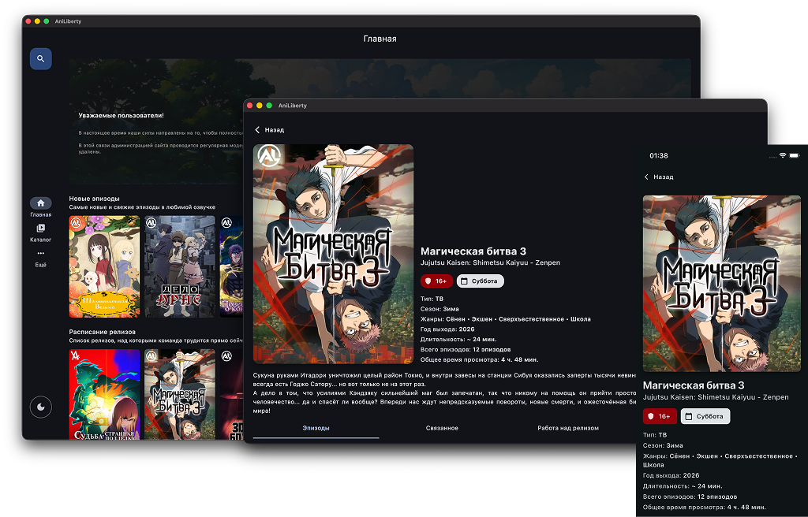

# Aniliberty Multiplatform

> Приложение для просмотра аниме на всех платформах

## 📱 О проекте

Клиент для сайта [Aniliberty](https://aniliberty.top/)

**Aniliberty Multiplatform** (ранее AniLibria) — это кроссплатформенное приложение для просмотра аниме, разработанное на Flutter. Проект находится в активной разработке и будет поддерживать все основные платформы.

## ⚠️ Текущий статус

Проект находится в **супер альфа** стадии разработки. Исходный код опубликован, но API и функциональность ещё активно меняются.

## 📥 Скачать

### Релизы

- [Android APK](https://github.com/wwwhttpru/aniliberty_multiplatform/releases)
- [MacOS DMG](https://github.com/wwwhttpru/aniliberty_multiplatform/releases)
- [WEB-версия](https://wwwhttpru.github.io/aniliberty_multiplatform/)

### Другие платформы

- iOS — в разработке
- Desktop (Windows, Linux) — в разработке

## 🛠️ Технологии

- **Flutter** — кроссплатформенная разработка
- **Dart** — язык программирования

## 🤝 Обратная связь

Мы будем рады любому фидбэку и предложениям! Вы можете:

- Создать [Issue](https://github.com/wwwhttpru/aniliberty_multiplatform/issues) для сообщения об ошибках или предложениях
- Обсудить проект в [Discussions](https://github.com/wwwhttpru/aniliberty_multiplatform/discussions)

## 🔮 Планы на будущее

- ✅ Публикация исходного кода
- ⏳ Поддержка всех платформ (iOS, Desktop)
- ⏳ Стабильные релизы для всех платформ

---

**Примечание:** Проект активно разрабатывается. Функциональность может изменяться.
